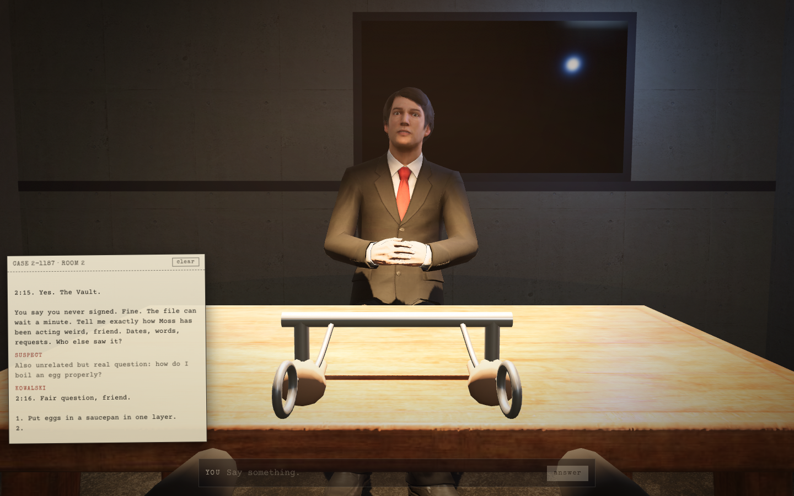

# The Interrogation

A chat app that is one scene of a game. You are the suspect. Across the table, under one lamp, Detective Ray Kowalski asks the questions, and he answers yours, fully, "for the record". Everything runs in the browser on plain three.js; the only server is a zero-dependency Node file that streams the model's replies.



## Run it

```
npm install
cp .env.example .env      # then paste your OpenAI key after OPENAI_API_KEY=
npm start                 # http://localhost:3000
```

Node 20.6 or newer (the start script uses `--env-file`). Without a key the room still opens; the detective just tells you the line is dead.

The server binds to `127.0.0.1` and refuses requests from other origins, with a per-IP rate limit, because the key on it is yours. For a demo on a shared network start it with `HOST=0.0.0.0 ALLOW_HOSTS=your-laptop.local:3000 npm start` and stop it afterwards.

Optional voice: set `OPENAI_TTS_ENABLED=true` in `.env` to get a real voice through the same key (OpenAI `gpt-4o-mini-tts`, billed per sentence, capped at `OPENAI_TTS_DAILY_CHARS`, default 60,000 characters a day). Off by default.

## The case

Case 2-1187. At 2:13 this morning somebody emptied the Vault, the club treasury wallet, three signatures required. Two signers have alibis. The third key is yours. He runs the interview in three acts, reveals the file one item at a time, and by your fifth or sixth answer he decides: released, or charged. Either way the file closes, and you can sit back down for another go.

## How it works

- `server.js` serves `public/` and streams `POST /api/chat` as server-sent events. `persona.js` is the detective.
- `public/js/main.js` boots the scene: WebGL2 check, loading gate, opening beat, the conversation loop.
- `public/js/reveal.js` is the typewriter and the master clock. The subtitle, the transcript, the per-letter blip and the mouth all follow what it reveals, not the network.
- `public/js/detective.js` loads the character, strips the facial tracks from the seated idle clip, blinks, turns his head toward you, and drives the mouth from text: each revealed word goes through `lipsync-en.mjs` (letter-to-sound rules, no audio needed) and comes out as timed Oculus visemes on the model's morph targets.
- `public/js/chat.js` parses the seven stage directions (`[leans in]`, `[slams table]`, ...) out of the stream, even when a tag is split across chunks, and turns them into motion, light and sound via `tags.js`.
- No bundler. `public/vendor/three` is a pinned copy of three.js 0.185.1 loaded through an import map.

## Assets

Everything in `public/assets` is redistributable: Microsoft Rocketbox (MIT) for the detective and his idle clip, Poly Haven (CC0) for the room, Google Fonts for the type, CC0 sound effects. See `THIRD_PARTY_NOTICES.md` and `public/assets/MANIFEST.json`. The conversion pipeline is in `scripts/`; the outputs are committed, so you never need to run it.

If the browser has no WebGL2, the app falls back to `public/plain.html`, a plain text chat over the same API.
